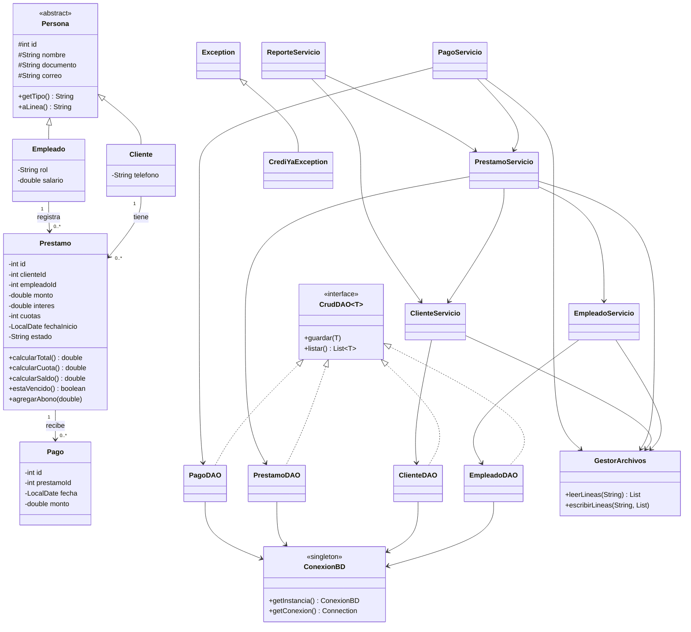

# Diagrama UML de clases - CrediYa

Este diagrama esta escrito en Mermaid. GitHub lo dibuja automaticamente al abrir este archivo.
Tambien se puede pegar en https://mermaid.live para exportarlo como imagen (PNG o SVG).

